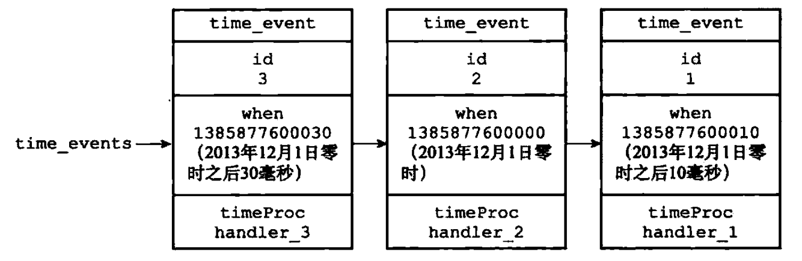
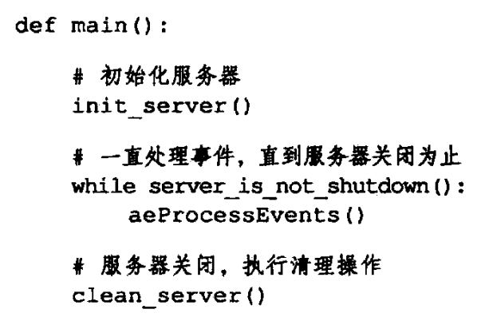

# 线程模型

## 1 什么是 Redis 事件

1. Redis 服务器是一个**事件驱动程序**，服务器需要处理以下两类事件：
2. **文件事件**：

   1. Redis 服务器**通过套接字与客户端**（或者其他 Redis 服务器）**进行连接**，而**文件事件就是服务器对套接字操作的抽象**。
   2. **服务器与客户端**（或者其他服务器）**的通信会产生相应的文件事件**，而**服务器就是通过监听并处理这些事件来完成一系列网络通信操作**。
3. **时间事件**：

   1. Redis 服务器中的**一些操作**（比如`serverCron` 函数）**需要在给定的时间点运行**，而**时间事件就是服务器对这类定时操作的抽象**。

## 2 事件分类

Redis 中的事件可以分为两类，分别是**文件事件**和**时间事件**。

### 2.1 文件事件

#### 2.1.1 含义

1. Redis**基于 [Reactor 模式](https://notebook.grayson.top/project-49/doc-846)开发了自己的网络事件处理器**，这个处理器被称为**文件时间处理器**。
2. **文件事件处理器使用 I/O 多路复用程序来同时监听多个套接字**，并**根据套接字目前执行的任务来为套接字关联不同的事件处理器**。
3. 当**被监听的套接字准备好执行连接应答**、**读取**、**写入**、**关闭等操作时**，**与操作相对应的文件事件就会产生**，这时**文件处理器就会调用套接字之前关联好的事件处理器来处理这些事件**。
4. 虽然**文件处理器以单线程方式运行**，但**通过使用 I/O 多路复用程序来监听多个套接字**，文件处理器**既实现了高性能的网络通信模型**，**又很好地与 Redis 服务器中其他同样以单线程方式运行的模块进行对接**，这**保持了 Redis 内部单线程设计的简单性**。

#### 2.1.2 文件事件处理器

文件事件处理器主要由四个部分组成，分别是**套接字**、**I/O 多路复用程序**、**文件事件分派器**、**事件处理器**。

1. **套接字**：
   1. **文件事件是对套接字操作的抽象**，**每当一个套接字准备好执行连接应答**、**写入**、**读取**、**关闭等操作时**，就**会产生一个文件事件**，因为**一个服务器通常会连接多个套接字**，所以**多个文件事件可能会并发地出现**。
2. **I/O 多路复用程序**：
   1. **I/O 多路复用程序负责监听多个套接字**，并**向文件事件分派器传送那些产生了事件的套接字**。
   2. 尽管**多个文件事件可能会并发地出现**，但**I/O 多路复用程序总是会将所有产生事件的套接字放到一个队列里面**，然后**通过这个队列**，**以有序**、**同步**、**每次一个套接字的方式向文件事件分派器传送套接字**，**当上一个套接字产生的事件被处理完毕之后**，**I/O 多路复用程序才会继续向文件事件分派器传送下一个套接字**。

      
3. **文件事件分派器**：
   1. 文件事件分派器**接收 I/O 多路复用程序传来的套接字**，并**根据套接字产生的事件的类型**，**调用相应的事件处理器**。
4. **事件处理器**：
   1. **服务器会为执行不同任务的套接字关联不同的事件处理器**，**这些处理器是一个个函数**，他们**定义了某个事件发生时**，**服务器应该执行怎样的动作**。
   2. Redis 为文件事件编写了多个处理器，这些事件处理器分别用于实现不同的网络通信需求：
      1. 为了**对连接服务器的各个客户端进行应答**，服务器要监听套接字关联**连接应答处理器**。
      2. 为了**接收客户端传来的命令请求**，服务器要为客户端套接字关联**命令请求处理器**。
      3. 为了**向客户端返回命令的执行结果**，服务器要为客户端套接字关联**命令回复处理器**。
      4. 当**主服务器和从服务器进行复制操作**时，主从服务器都需要关联特别为复制功能编写的**复制处理器**。
   3. 这些事件处理器里面，服务器最常用的有**连接应答处理器**、**命令请求处理器**和**命令回复处理器**：
      1. **连接应答处理器**：
         1. `networking.c/acceptTcpHandler` 函数是 Redis 的连接应答处理器，这个处理器**用于对连接服务器监听套接字的客户端进行应答**，具体实现为 `sys/socket.h/accept` 函数的包装。
         2. **当 Redis 服务器进行初始化的时候**，**程序会将这个连接应答处理器和服务器监听套接字的 `AE_READABLE` 事件关联起来**，**当有客户端用 `sys/socket.h/connect` 函数连接服务器监听套接字的时候**，**套接字就会产生 `AE_READABLE` 事件**，**引发连接应答处理器执行**，**并执行相应的套接字应答操作**。

            
      2. **命令请求处理器**：
         1. `networking.c/readQueryFromClient`函数是Redis的命令请求处理器，这个处理器**负责从套接字中读入客户端发送的命令请求内容**，具体实现为 `unistd.h/read`函数的包装。
         2. **当一个客户端通过连接应答处理器成功连接到服务器之后**，**服务器会将客户端套接字的 `AE_READABLE`事件和命令请求处理器关联起来**，**当客户端向服务器发送命令请求的时候**，**套接字就会产生 `AE_READABLE`事件**，**引发命令请求处理器执行**，**并执行相应的套接字读入操作**。
         3. **在客户端连接服务器的整个过程中**，**服务器都会一直为客户端套接字的 `AE_READABLE`事件关联命令请求处理器**。

            
      3. **命令回复处理器**：
         1. `networking.c/sendReplyToClient`函数是Redis的命令回复处理器，这个处理器**负责将服务器执行命令后得到的命令回复结果通过套接字返回给客户端**，具体实现为 `unistd.h/write`函数的包装。
         2. **当服务器有命令回复需要传给客户端的时候**，**服务器会将客户端套接字的 `AE_WRITABLE`事件和命令回复处理器关联起来**，**当客户端准备好接收服务器传回的命令回复时**，**就会产生 `AE_WRITABLE`事件**，**引发命令回复处理器执行**，**并执行相应的套接字写入操作**。
         3. **当命令回复发送完毕之后**，**服务器就会解除命令回复处理器与客户端套接字的 `AE_WRITABLE`事件之间的关联**。

            

            > 套接字产生的事件类型有哪些？
            >
            > 1. 套接字产生的事件类型有两种，分别是`AS_READABLE` 事件和`AS_WRITABLE` 事件：
            >    1. 当**套接字变得可读**时（**客户端对套接字执行 `write` 操作**，**或者执行 `close` 操作**），或者**有新的可应答套接字出现时**（**客户端对服务器的监听套接字执行 `connect` 操作**），**套接字产生 `AE_READABLE` 事件**。
            >    2. 当**套接字变得可写**时（**客户端对套接字执行 `read` 操作**），**套接字产生 `AE_WRITABLE` 事件**。
            > 2. I/O 多路复用程序**允许同时监听套接字的 `AE_READABLE` 事件和 `AE_WRITABLE` 事件**，如果**一个套接字同时产生了这两种事件**，那么文件事件分派器会**优先处理 `AE_READABLE` 事件**，**等到 `AE_READABLE` 事件处理完之后**，**才处理 `AE_WRITABLE` 事件**。
            >

#### 2.1.3 一次完整的客户端与服务器连接事件示例

1. 假设一个 Redis 服务器正在运作，那么这个服务器的**监听套接字的 `AE_READABLE` 事件应该正处于监听状态之下**，而**该事件所对应的处理器为连接应答处理器**。
2. 如果这时**有一个 Redis 客户端向服务器发起连接**，那么**监听套接字将产生 `AE_READABLE` 事件**，**触发连接应答处理器执行**，**处理器会对客户端的连接请求进行应答**，然后**创建客户端套接字**，**以及客户端状态**，**并将客户端套接字的 `AS_READABLE` 事件与命令请求处理器进行关联**，使得**客户端可以向主服务器发送命令请求**。
3. 之后，**假设客户端向主服务器发送一个命令请求**，那么**客户端套接字将产生 `AE_READABLE` 事件**，**引发命令请求处理器执行**，**处理器读取客户端的命令内容**，然后**传给相关程序去执行**。
4. **执行程序将产生相应的命令回复**，**为了将这些命令回复传送回客户端**，**服务器将客户端套接字的** `AE_WRITABLE`**事件与命令回复处理器进行关联**，当**客户端尝试读取命令回复的时候**，**客户端套接字将产生 `AE_WRITABLE` 事件**，**触发命令回复处理器执行**，当**命令回复处理器将命令回复全部写入到套接字之后**，服务器就会**解除客户端套接字的 `AE_WRITABLE` 事件与命令回复处理器之间的关联**。

   

### 2.2 时间事件

#### 2.2.1 含义

1. Redis的时间事件分为以下两类：
   1. **定时事件**：
      1. **让一段程序在指定的时间之后执行一次**，比如说，让程序`X`在当前时间的30毫秒之后执行一次。
   2. **周期性事件**：
      1. **让一段程序每隔指定时间就执行一次**，比如说，让程序`Y`每隔30毫秒就执行一次。
2. 一个时间事件主要由以下三个属性组成：
   1. `id`：
      1. **服务器为时间事件创建的全局唯一ID**（标识号）。
      2. **ID号按从小到大的顺序递增**，**新事件的ID号比旧事件的ID号要大**。
   2. `when`：
      1. **毫秒精度的UNIX时间戳**。
      2. **记录了时间事件的到达**（arrive）**时间**。
   3. `timeProc`：
      1. **时间事件处理器**，**一个函数**。
      2. **当时间事件到达时**，**服务器就会调用相应的处理器来处理事件**。
      3. **一个时间事件是定时事件还是周期性事件取决于时间事件处理器的返回值**：
         1. **如果事件处理器返回 `ae.h/AE_NOMORE`**，**那么这个事件为定时事件**，**该事件在达到一次之后就会被删除**，**之后不在到达**。
         2. **如果事件处理器返回一个非 `AE_NOMORE`的整数值**，**那么这个事件为周期性事件**，**当一个时间事件到达之后**，**服务器会根据事件处理器返回的值**，**对时间事件的 `when`属性进行更新**，**让这个事件在一段时间之后再次到达**，**并以这种方式一直更新并运行下去**，比如说，如果一个时间事件的处理器返回整数值30，那么服务器应该对这个时间事件进行更新，让这个事件在30毫秒之后再次到达。
      4. **目前版本的Redis只使用周期性事件**，**而没有使用定时事件**。

#### 2.2.2 实现

1. **服务器将所有时间事件都放在一个无序链表中**，**每当时间事件执行器运行时**，**他就遍历整个链表**，**查找所有已到达的时间事件**，**并调用相应的事件处理器**。
2. 下图展示了一个保存时间事件链表的例子：
   1. 链表中包含了三个不同的时间事件，因为**新的时间事件总是插入到链表的表头**，所以三个时间事件分别**按ID逆序排序**，表头事件的ID为3，中间事件的ID为2，表尾的事件为1。
   2. 需要注意的是我们说**保存时间事件的链表为无序链表**，**指的不是链表不按ID排序**，**而是说该链表不按 `when`属性的大小排序**，正因为链表没有按 `when`属性进行排序，所以**当时间事件执行器运行的时候**，他**必须遍历链表中的所有时间事件**，**这样才能确保服务器中所有已到达的时间事件都会被处理**。

      

#### 2.2.3 实例：serverCron函数

1. 持续运行的Redis服务器需要**定期对自身的资源和状态进行检查和调整**，从而**确保服务器可以长期**、**稳定的运行**，这些定期操作由`redis/serverCron`函数负责执行，他的主要工作包括：
   1. **更新服务器中的各类统计信息**，比如时间、内存占用、数据库占用情况等。
   2. **清理数据库中的[过期键值对](https://notebook.grayson.top/project-37/doc-812)**。
   3. **关闭和清理连接失效的客户端**。
   4. **尝试进行[AOF](https://notebook.grayson.top/project-37/doc-806/#2-2-AOF)或[RDB](https://notebook.grayson.top/project-37/doc-806/#2-1-RDB)持久化操作**。
   5. **如果服务器是主服务器**，**那么对从服务器进行定期同步**。
   6. **如果处于集群模式**，**对集群进行定期同步和连接测试**。
2. **Redis服务器以周期性事件的方式来运行 `serverCron`函数**，**在服务器运行期间**，**每隔一段时间**，`serverCron`**就会执行一次**，**直到服务器关闭为止**。

### 2.3 事件的调度与执行

1. 因为**服务器中同时存在文件事件和时间事件两种事件类型**，所以**服务器必须对这两种事件进行调度**，**决定何时应该处理文件事件**，**何时又应该处理时间事件**，**以及花多少时间来处理他们等等**。
2. 事件的调度和执行由 `ae.c/aeProcessEvents`函数负责，该函数的伪代码如下所示：

   
3. 将 `aeProcessEvents`函数置于一个循环里面，加上初始化和清理函数，这就构成了Redis服务器的主函数，其伪代码如下所示：

   
4. 事件的调度和执行规则如下：

   1. `aeApiPoll`**函数的最大阻塞时间由到达时间最接近当前时间的时间事件决定**，**这个方法既可以避免服务器对时间事件进行频繁的轮询**（忙等待），**也可以确保 `aeApiPoll`函数不会阻塞过长时间**。
   2. **因为文件事件是随机出现的**，**如果等待并处理完一次文件事件之后**，**仍未有任何时间事件到达**，**那么服务器将再次等待并处理文件事件**，**随着文件事件的不断执行**，**事件会逐渐向时间事件所设置的到达事件逼近**，**并最终来到到达时间**，**这时服务器就可以开始处理到达的时间事件了**。
   3. **对文件事件和事件事件的处理都是同步**、**有序**、**原子地执行的**，**服务器不会中途中断事件处理**，**也不会对事件进行抢占**，因此，**不管是文件事件的处理器**，**还是时间事件的处理器**，他们**都会尽可能的减少程序的阻塞时间**，**并在有需要时主动让出执行权**，**从而降低造成事件饥饿的可能性**，比如说，在命令回复处理器将一个命令回复写入到客户端套接字时，如果写入字节数超过了一个预设常量的话，命令回复处理器就会主动用`break`跳出写入循环，将余下的数据留到下次再写，另外，时间事件也会将非常耗时的持久化操作放到子线程或者子进程执行。
   4. **因为时间事件在文件事件之后执行**，**并且事件之间不会出现抢占**，**所以时间事件的实际处理时间通常会比时间事件设定的到达事件稍晚一些**。
   5. 具体的实例如下：
      1. 下表记录了一次完整的事件调度和执行过程：

         
      2. 因为**时间事件尚未到达**，所以**在处理时间事件之前**，**服务器已经等待并处理了两次文件事件**。
      3. 因为**处理时间的过程中不会出现抢占**，所以**实际处理时间事件的时间比预定的100毫秒慢了30毫秒**。

## 参考文献

1. [【面试题】技术面试题汇总 🔥](https://imageslr.com/2020/07/08/tech-interview.html)。
2. redis 设计与实现（第二版）。
3. [Redis 系列（六）：你说要看 Redis 线程模型？安排](https://xie.infoq.cn/article/b6733865dbf95ddcf9968156a)。
